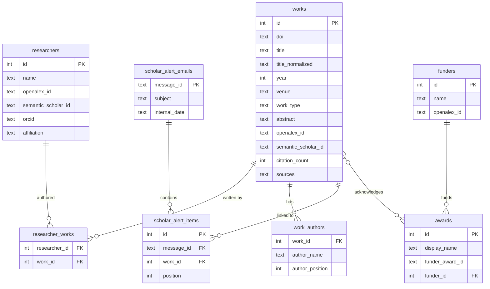

# pubs

[](https://github.com/dscotheque/pubs/actions/workflows/sync-pubs.yml)
[](https://www.python.org)
[](https://github.com/dscotheque/pubs/commits/main)

Publication tracking for the [DScotheque Lab](https://dsco.ischool.uw.edu/) at the University of Washington. Powered by [labpubs](https://github.com/nniiicc/labpubs).

Syncs publications from **OpenAlex**, **Crossref**, and **Google Scholar alert emails** into a local SQLite database with cross-source deduplication, BibTeX/JSON/CSL-JSON exports, a REST API, and Slack notifications.

<details>
<summary>Table of Contents</summary>

- [Prerequisites](#prerequisites)
- [Setup](#setup)
- [Architecture](#architecture)
- [Nightly Sync (GitHub Actions)](#nightly-sync-github-actions)
- [REST API](#rest-api)
- [MCP Server](#mcp-server)
- [Google Scholar Alert Ingestion](#google-scholar-alert-ingestion)
- [Slack Integration](#slack-integration)
- [CLI Reference](#cli-reference)
- [Configuration](#configuration)
- [Data Model](#data-model)
- [Development](#development)
- [Adding a New Lab Member](#adding-a-new-lab-member)
- [Upstream Contributions](#upstream-contributions)

</details>

## Prerequisites

- Python >= 3.11
- [uv](https://docs.astral.sh/uv/) for package management
- A Gmail account with IMAP enabled (for Scholar alert ingestion)

## Setup

```bash
# Clone the repository
git clone https://github.com/dscotheque/pubs.git
cd pubs

# Install dependencies
uv sync

# Copy the environment template and fill in secrets
cp .env.example .env

# Run initial sync (takes ~15-30 minutes for all 47 researchers)
uv run labpubs -c labpubs.yaml sync

# Verify publications were imported
uv run labpubs -c labpubs.yaml list
```

## Architecture

```
pubs/
|-- labpubs.yaml          # Configuration (47 researchers, sources, alerts)
|-- pubs.db               # SQLite database (committed for incremental sync)
|-- .github/workflows/
|   +-- sync-pubs.yml     # Nightly cron: sync + ingest + notify + commit
|-- src/pubs_api/         # FastAPI REST API layer
|   |-- app.py            # Application factory
|   |-- dependencies.py   # Engine dependency injection
|   +-- routers/          # Endpoint modules (works, researchers, exports, stats)
|-- patches/
|   +-- dedup.py          # "Richer wins" merge strategy (patched into labpubs)
|-- scripts/
|   +-- link_scholar_works.py  # Links orphaned scholar-alert works to researchers
+-- tests/                # 65 tests (API, dedup, scholar linking)
```

**Three-layer design:**

1. **[labpubs](https://github.com/nniiicc/labpubs)** -- upstream library providing source backends
   (OpenAlex, Semantic Scholar, Crossref), database schema, deduplication, CLI, exports, and an
   MCP server.
2. **Patches** -- [patches/dedup.py](patches/dedup.py) overrides the upstream merge strategy. The
   default "existing wins" approach preserves sparse metadata from early sources (e.g., truncated
   Google Scholar titles like "Computational Approache...") even when a richer source arrives later.
   Our patch prefers longer, non-truncated values for title, authors, and venue.
3. **REST API** -- [src/pubs_api/](src/pubs_api/) wraps the labpubs engine in a FastAPI application
   for web dashboards and programmatic access.

The SQLite database (`pubs.db`) is committed to the repository. This enables the nightly GitHub
Action to perform incremental syncing -- each run reads `last_sync` from the DB, fetches only newer
publications, and commits the updated DB back.

## Nightly Sync (GitHub Actions)

A [GitHub Action](.github/workflows/sync-pubs.yml) runs daily at 6:00 AM UTC to sync new
publications and notify Slack.

**Workflow steps:**

1. Fetches new publications from OpenAlex and Crossref
2. Patches the installed labpubs with [patches/dedup.py](patches/dedup.py) for richer merge
   behavior
3. Ingests Google Scholar alert emails (if IMAP credentials are configured)
4. Links orphaned scholar-alert works to researchers via
   [scripts/link_scholar_works.py](scripts/link_scholar_works.py)
5. Posts new finds to the `#lab-papers` Slack channel (only when new publications are found)
6. Commits the updated database and exports back to the repo

### Required GitHub Secrets

Add these at **Settings > Secrets and variables > Actions**:

| Secret | Required | Purpose |
|--------|----------|---------|
| `SLACK_WEBHOOK_URL` | Yes | Slack incoming webhook for notifications |
| `SCHOLAR_EMAIL` | Optional | Gmail address receiving Scholar alerts |
| `SCHOLAR_PASSWORD` | Optional | Gmail App Password for IMAP access |

## REST API

A FastAPI server exposes the publication database over HTTP.

```bash
# Start the API server
uv run uvicorn pubs_api.app:app --host 0.0.0.0 --port 8000
```

### Endpoints

| Method | Path | Description |
|--------|------|-------------|
| GET | `/researchers` | List all tracked lab members |
| GET | `/works` | List publications (query params: `researcher`, `year`, `funder`, `limit`) |
| GET | `/works/search?q=` | Full-text search across titles and abstracts |
| GET | `/works/{doi}` | Get a specific publication by DOI |
| GET | `/export/bibtex` | Export as BibTeX (query params: `researcher`, `year`) |
| GET | `/export/json` | Export as JSON |
| GET | `/export/csl-json` | Export as CSL-JSON (for citation managers) |
| GET | `/stats` | Summary statistics |

Interactive docs available at `http://localhost:8000/docs` when the server is running.

### Examples

```bash
# Get all publications
curl http://localhost:8000/works

# Search for a topic
curl "http://localhost:8000/works/search?q=misinformation"

# Get a researcher's publications
curl "http://localhost:8000/works?researcher=Jevin+West"

# Export BibTeX for a specific year
curl "http://localhost:8000/export/bibtex?year=2024"
```

## MCP Server

labpubs includes a built-in MCP server for AI assistant integration.

```bash
# Start the MCP server
uv run labpubs -c labpubs.yaml mcp
```

### Claude Desktop Configuration

Add to `~/Library/Application Support/Claude/claude_desktop_config.json`:

```json
{
  "mcpServers": {
    "labpubs": {
      "command": "uv",
      "args": ["run", "--directory", "/path/to/pubs", "labpubs", "-c", "labpubs.yaml", "mcp"]
    }
  }
}
```

## Google Scholar Alert Ingestion

Supplements API-based syncing by ingesting publications from Google Scholar alert emails via IMAP.
Catches papers that OpenAlex may not yet index.

### Prerequisites

1. **Google Scholar Alerts** -- Create alerts for each researcher at
   [scholar.google.com/scholar_alerts](https://scholar.google.com/scholar_alerts) (profile-based or
   search-term alerts)
2. **Gmail App Password** -- Generate at
   [myaccount.google.com/apppasswords](https://myaccount.google.com/apppasswords) (requires 2-Step
   Verification)
3. **Enable IMAP** -- In Gmail Settings > Forwarding and POP/IMAP > Enable IMAP

### Credentials

Store credentials in your `.env` file (never in the YAML):

```
SCHOLAR_EMAIL=your.email@gmail.com
SCHOLAR_PASSWORD="xxxx xxxx xxxx xxxx"
```

> **Note:** Gmail app passwords contain spaces, so wrap the value in quotes.

### How It Works

1. Connects to Gmail via IMAP and fetches Scholar alert emails
2. Parses each email's HTML to extract publication title, authors, venue, year, and URL
3. Matches each alert email to a researcher using the `scholar_alerts.researcher_map` in
   `labpubs.yaml` (44 of 47 researchers matched by Google Scholar profile ID, 3 by subject prefix)
4. Deduplicates against existing works (DOI, fuzzy title match, author+year fallback)
5. Links orphaned works to researchers by matching alert subject names to canonical researcher
   names, with support for nicknames ("Tanushree" -> "Tanu"), middle initials
   ("Emma S. Spiro" -> "Emma Spiro"), and abbreviated author names
   ("BCG Lee" -> "Benjamin Charles Germain Lee")

### CLI

```bash
# Ingest all Scholar alert emails (default)
uv run labpubs -c labpubs.yaml ingest scholar-alerts

# Only process unread emails
uv run labpubs -c labpubs.yaml ingest scholar-alerts --unseen-only

# Preview without saving
uv run labpubs -c labpubs.yaml ingest scholar-alerts --dry-run
```

The nightly GitHub Action runs this automatically when `SCHOLAR_EMAIL` and `SCHOLAR_PASSWORD`
secrets are configured.

## Slack Integration

To set up the Slack notification channel:

1. Go to [api.slack.com/apps](https://api.slack.com/apps) and click **Create New App** > **From
   scratch**
2. Name it (e.g., "Lab Publications Bot"), select your workspace
3. In the left sidebar, click **Incoming Webhooks** > toggle **On**
4. Click **Add New Webhook to Workspace**
5. Select the `#lab-papers` channel (or create it first) and click **Allow**
6. Copy the Webhook URL

Store it as:

- **GitHub Secret**: `SLACK_WEBHOOK_URL` (for the nightly cron)
- **Local `.env` file** (for manual testing):
  ```
  SLACK_WEBHOOK_URL=https://hooks.slack.com/services/T.../B.../...
  ```

### Test notifications locally

```bash
export SLACK_WEBHOOK_URL=$(grep SLACK_WEBHOOK_URL .env | cut -d= -f2)
sed "s|\${SLACK_WEBHOOK_URL}|$SLACK_WEBHOOK_URL|g" labpubs.yaml > /tmp/labpubs-resolved.yaml
uv run labpubs -c /tmp/labpubs-resolved.yaml notify --days 7
```

## CLI Reference

```bash
# Sync all researchers
uv run labpubs -c labpubs.yaml sync

# Sync one researcher
uv run labpubs -c labpubs.yaml sync --researcher "Jevin West"

# List publications
uv run labpubs -c labpubs.yaml list
uv run labpubs -c labpubs.yaml list --researcher "Nic Weber" --year 2024

# Export
uv run labpubs -c labpubs.yaml export bibtex -o pubs.bib
uv run labpubs -c labpubs.yaml export json -o pubs.json
uv run labpubs -c labpubs.yaml export csl-json -o pubs-csl.json

# Show details for a specific work
uv run labpubs -c labpubs.yaml show "some search query"

# Ingest Google Scholar alert emails
uv run labpubs -c labpubs.yaml ingest scholar-alerts

# Link orphaned scholar-alert works manually
uv run python scripts/link_scholar_works.py

# List researchers and their IDs
uv run labpubs -c labpubs.yaml researchers

# Send notification digest
uv run labpubs -c labpubs.yaml notify --days 7

# Start the MCP server
uv run labpubs -c labpubs.yaml mcp

# Start the REST API
uv run uvicorn pubs_api.app:app --host 0.0.0.0 --port 8000
```

## Configuration

| Variable | Default | Description |
|----------|---------|-------------|
| `SLACK_WEBHOOK_URL` | -- | Slack incoming webhook URL |
| `SCHOLAR_EMAIL` | -- | Gmail address receiving Scholar alerts |
| `SCHOLAR_PASSWORD` | -- | Gmail App Password (not your account password) |

The full configuration lives in [labpubs.yaml](labpubs.yaml). Key sections:

- `researchers` -- 47 tracked researchers with names, ORCIDs, and OpenAlex/Semantic Scholar IDs
- `sources` -- Enabled backends (`openalex`, `crossref`)
- `scholar_alerts` -- IMAP settings and researcher-to-alert mappings
- `notifications.slack` -- Webhook URL and target channel
- `exports` -- Output paths for BibTeX and JSON exports

## Data Model



## Development

```bash
# Install with dev dependencies
uv sync --extra dev

# Run tests (65 tests)
uv run pytest

# Lint
uv run ruff check src/ tests/ patches/ scripts/

# Format
uv run ruff format src/ tests/ patches/ scripts/

# Type check
uv run mypy src/
```

### Test Structure

| Module | Tests | Covers |
|--------|-------|--------|
| `test_works.py` | 10 | `/works` endpoints (list, search, DOI lookup) |
| `test_researchers.py` | 2 | `/researchers` endpoint |
| `test_exports.py` | 5 | `/export` endpoints (BibTeX, JSON, CSL-JSON) |
| `test_stats.py` | 1 | `/stats` endpoint |
| `test_dedup_patch.py` | 24 | Richer merge strategy (`_pick_richer_str`, `_pick_richer_authors`, `merge_works`) |
| `test_link_scholar_works.py` | 23 | Name matching, author validation, end-to-end orphan linking |

## Adding a New Lab Member

1. Add a researcher entry under `researchers:` in `labpubs.yaml`:

```yaml
- name: "New Person"
  orcid: "0000-0000-0000-0000"
  openalex_id: "A5000000000"  # Look up at https://api.openalex.org/authors/https://orcid.org/ORCID
```

2. Add a Scholar alert mapping under `scholar_alerts.researcher_map:`:

```yaml
- researcher_name: "New Person"
  scholar_profile_user: "XXXXXXXXXXXX"  # From https://scholar.google.com/citations?user=XXXXXXXXXXXX
```

If the researcher doesn't have a Google Scholar profile, use `alert_subject_prefix` instead:

```yaml
- researcher_name: "New Person"
  alert_subject_prefix: "New Person"
```

3. Run the initial sync:

```bash
uv run labpubs -c labpubs.yaml sync --researcher "New Person"
```

## Upstream Contributions

Several features developed in this repository have been contributed back to
[labpubs](https://github.com/nniiicc/labpubs):

| PR | Feature |
|----|---------|
| [#3](https://github.com/nniiicc/labpubs/pull/3) | "Richer wins" merge strategy for cross-source deduplication |
| [#4](https://github.com/nniiicc/labpubs/pull/4) | Post-ingest scholar alert orphan linking (`link-orphans` command) |
| [#5](https://github.com/nniiicc/labpubs/pull/5) | Change `unseen_only` default to `false` |
| [#6](https://github.com/nniiicc/labpubs/pull/6) | Example GitHub Actions workflow for nightly sync |
| [#7](https://github.com/nniiicc/labpubs/pull/7) | REST API layer (`labpubs serve` command) |

## Acknowledgments

- [labpubs](https://github.com/nniiicc/labpubs) -- upstream publication tracking library
- [OpenAlex](https://openalex.org/) -- open scholarly metadata
- [Semantic Scholar](https://www.semanticscholar.org/) -- AI-powered research tool
- [Crossref](https://www.crossref.org/) -- DOI registration and metadata
